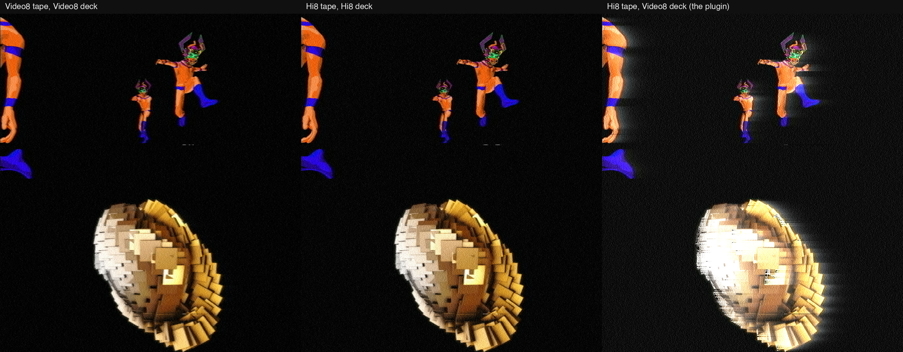

# lowband

> **AI-assisted project.** This codebase was created with [Claude](https://claude.com/claude-code)
> (Anthropic), directed and reviewed by a human author. The deck is not asserted but
> measured: an offline harness drives the real plugin class in a headless GL context on a
> synthetic clock, and the engine it runs, and reads every property back out — the recorded
> carriers, counted crossing by crossing, are Hi8's 5.7 / 7.7 MHz and Video8's 4.2 / 5.4 MHz
> on PAL and NTSC; a deck playing its own format gives a flat field back to 3e-4 of white;
> Hi8 on a Video8 deck has a gain of 1.66675 against 2.0 / 1.2 = 1.66667; the mismatched
> emphasis leaves a tail of 1.316 µs against Video8's 1.30; the lifted black is 0.0497
> against 0.0516 predicted from the sync the back porch still holds; the noise at white
> over the noise at black is 2.6, where the deck band's |H| predicts 2.2 and a Video8 tape
> gives 1.02; the head clog's taps realise Wallace's spacing loss to 1e-8 of the truncated
> law — with twelve negative controls that prove each check can fail. It has **never been
> loaded into Resolume**; it is loaded by [oxbow](https://github.com/stoatworks-labs/oxbow),
> which is a real FFGL host and is not Resolume. See [Status](#status).

A Hi8 tape played back on a Video8 deck, as an FFGL effect for
[Resolume](https://resolume.com) Arena and Avenue.


<sub>One frame, rendered by `lbtest --pipe`, the offline harness — not captured from
Resolume. Resolume's bundled demo clip Metalive at the defaults.</sub>

## The one idea

Hi8 is Video8 with the luma's FM carrier moved up. Video8 records the picture as a
frequency between 4.2 MHz (the sync tip) and 5.4 MHz (peak white); Hi8 between 5.7 and
7.7 MHz, with 2.0 MHz of deviation where Video8 has 1.2. The colour, heterodyned down under
the luma at 732 kHz (PAL) or 743 kHz (NTSC), stayed exactly where it was.

So a Video8 deck reads a Hi8 tape through a head, a channel and a demodulator built for a
carrier a megahertz and a half lower — and **lowband models the luma as that FM signal**:
modulated by the tape's format, band-limited by the deck's channel, limited, demodulated by
counting zero crossings at 40.5 MHz, mapped back to volts by the deck's idea of the format
and de-emphasised with the deck's time constant. Nothing in the picture is drawn on.

## What falls out

- **The contrast is 5/3 too high.** The deck maps 1.2 MHz of swing to the full picture; the
  tape swings 2.0. Midtones go bright, highlights clip.
- **A glow trails every highlight.** Hi8 pre-emphasises with a 0.47 µs time constant; the
  Video8 deck de-emphasises with 1.3 µs. Under the mismatch a step arrives half-way at once
  and creeps the rest of the way over a few microseconds: a bright edge smears to the right,
  a dark one leaves a glow behind it.
- **The black lifts.** The same mismatch on the sync pulse's trailing edge: the back porch,
  where the monitor clamps black, still holds part of the sync when it is read, so black
  comes out about 5 % up (6 % on NTSC).
- **Black streaks after bright edges.** At a black-to-white edge the pre-emphasis throws the
  carrier up to the white clip, 10.1 MHz — where the Video8 deck's band passes a twentieth
  of it. The limiter loses the crossings, the demodulator reads a low frequency, and the
  picture dips well below black just after the edge.
- **The highlights break up first.** Tape noise is the same at every frequency, but the
  carrier for white sits furthest outside the deck's band, so its carrier-to-noise is the
  worst. Raise Tape Noise or Head Clog and the whites dissolve into sparkle while the
  darks, and a Video8 tape at the same settings, stay clean.
- **The colour comes through** — Video8's own soft colour, because the colour-under band
  is common to both formats.

Play a Video8 tape, or use a Hi8 deck (which detects each tape's format and plays it in its
own mode), and the picture is clean. Those are the references the mismatch is measured
against.



<sub>Rendered by `lbtest --pipe` at the defaults, changing only Recording and Deck: Video8 on
Video8, Hi8 on Hi8, Hi8 on Video8.</sub>

### How it differs from Colourunder, Ferric and Old Cathode

[Colourunder](https://github.com/stoatworks-labs/colourunder) is VHS's colour-under chroma,
head switch, tracking and dropout compensator; its luma "FM" is a noise shape, never a
carrier, and it says it has no pre-emphasis clipping. Lowband has no head switch, no
tracking and no chroma heterodyne — its whole subject is the luma carrier and what a deck
built for another one makes of it. [Ferric](https://github.com/stoatworks-labs/ferric) is
the tape transport and the noise-reduction round trip;
[Old Cathode](https://github.com/stoatworks-labs/old-cathode) the broadcast composite route.
None of them modulates a carrier.

### The honest limit

What a real Video8 deck shows on a Hi8 tape was not found first-hand: forum summaries say
snow and streaking, and a Sony patent says only that the picture "tends to be disturbed".
This picture is the model's prediction. The deck's channel is a decoder's filters standing
in for a real head, equaliser and RF stage (a 1.9 MHz high-pass and an 8th-order
Butterworth at 7.0 MHz); the emphasis is the main shelf only, with no non-linear emphasis;
the white and dark clips come from a comment marked with a question mark; the noise levels
and the clog's range are chosen. No head switch, no tracking, no time-base error, no
dropout compensator, no chroma noise — colourunder and ferric have those.
[ATTRIBUTIONS.md](ATTRIBUTIONS.md) says which figures are sourced.

## Controls

| Group | |
| --- | --- |
| **Tape** | Recording (Video8, Hi8), Tape Noise (off at 0, then a carrier-to-noise ratio from 46 dB down to 10 dB), Dropouts (missing oxide: the carrier dips 30 dB for 1–25 µs). |
| **Deck** | Deck (Video8, Hi8: a Hi8 deck plays each tape in its own mode), Standard (PAL, NTSC), Head Clog (the head-to-tape spacing a dirty head adds, up to 0.15 µm, which costs the high carriers most). |
| **Monitor** | Sync AGC (off: the monitor clamps black and nothing else; on: it also scales the picture so the sync is its nominal height — which on a Hi8 tape takes back only part of the 5/3, because the sync is read through the same mismatched emphasis and measures short: Hi8 on Video8 ends at about 1.23× instead of 1.67×), Mix. |

The defaults are a PAL Hi8 tape on a Video8 deck with some tape noise (24.4 dB), a slightly
dirty head (0.06 µm) and a few dropouts: the highlights break up and the darks hold. Chosen
on Resolume's demo clips. The output is opaque at Mix 1: a tape has no alpha.

## Status

**Unreleased: a local v0.1.0, built 4 October 2026.** Not yet a fleet repo: no GitHub
repo, no release, no website page, no user guide, no browser demo. The About block and
ATTRIBUTIONS.md are provisional hand copies.

### Measured offline, on macOS

`tools/verify.sh` passes on this machine against a fresh universal Release build, running
every check at 320×180, 960×540 and 1280×720 and again on Apple's software renderer at
320×180. What it establishes:

- **Carriers.** Counted crossings in the recorded RF: Video8 4.1997 / 4.5600 / 5.3999 MHz
  at sync tip, blanking and white (PAL), Hi8 5.6988–5.6997 / 6.3001 / 7.7001 MHz, each
  within its window's settling and counting bound.
- **Matched decks.** Video8 on Video8 and Hi8 on Hi8, both standards: flat fields of 0.05,
  0.15 and 0.25 read back to 3.1e-4 at worst, inside the 2f carrier residual's bound.
- **Gain.** Hi8 on Video8: 1.66675 (PAL) and 1.66679 (NTSC) against 2.0 / 1.2 = 1.66667;
  matched decks 1.00003, 0.99980.
- **Emphasis.** Hi8 on Video8: the step's tail decays with 1.30–1.32 µs at the three
  rasters, against the deck's 1.30 µs; a rising step arrives short and creeps up; a
  matched deck leaves no tail (under 5e-4 of white 2.5 µs after the edge).
- **Clamp.** The lifted black reads 0.0497 (PAL) and 0.0581 (NTSC) against 0.0516 and
  0.0603 predicted from the analytic sync response at the clamp's window; a Video8 tape
  reads −0.0003.
- **Threshold.** At 30 dB, Hi8 on Video8 is 2.62× as noisy at white as at black (the
  band's |H| ratio, first order, says 2.17); a Video8 tape on the same deck 1.02 (1.00).
- **Streak.** A black-to-white edge on Hi8 on Video8 dips 0.56 below black — a third of
  the step; on a Hi8 deck 0.001.
- **Wallace.** The clog's 49 taps realise e^(−2πd/λ) less their own truncation to 1e-8,
  and stay within 0.2 dB of the law from 4.2 to 10.1 MHz up to 0.15 µm.
- **Registration.** A matched deck puts a small step 0.24–0.37 raster pixels late, within
  0.07 px of what the filters' own shape predicts once their DC delays are taken out.
- **Intake and display.** The intake is the host's exact area average in Y'UV to 1.3e-7;
  the host picture is the deck's picture read back, within GLSL's own division error.
- **Dropout.** A forced dropout changes its own line only, from 0.7 µs before it starts.
- **Threads.** 1, 3 and 8 workers give the same picture bit for bit, with noise, dropouts
  and a clog.
- **Resize.** A resize to 1.5× and back leaves every subpixel as it would have been.
- **Negative controls.** Hi8 written from Video8's tip fails the carriers; a demodulator
  counting only rising crossings, the matched decks; the deck using the tape's map, the
  gain; the deck using the tape's emphasis, the tail and the clamp; a Video8 band as wide as
  Hi8's, the threshold and the streak; the clog at the other standard's writing speed,
  Wallace; no delay compensation, registration; a dropout two lines down, the dropout;
  noise seeded by worker, the threads; a resize that restarts the clock, the resize. One
  character changed in the shipped GLSL (a Y' weight) fails `--intake`; one in the
  demodulator's B-spline fails `--matched` and `--gain`.
- **No dead controls**: all 8 change the picture.
- **The bundle** is universal, and oxbow sees `SW Lowband`, `LB01`, an effect, and renders
  120 frames through `plugMain`.

Render cost, `lbtest --bench` at the defaults (best of three, `glFinish` both sides, on a
machine running other builds):

| | ms/frame | % of a 60 fps frame | state held |
| --- | --- | --- | --- |
| 1280×720 | 3.9 | 23 % | 26 MB |
| 1920×1080 | 4.2 | 25 % | 26 MB |
| 3840×2160 | 5.3 | 32 % | 26 MB |

The FM chain runs on the CPU, eight lines in lock step on up to eight worker threads: about
2.6 ms of that is the chain (`lbtest --profile`: 14 ms on one worker), the rest the GPU's
intake, the read-back and the upload. The size of the host barely matters: the chain always
runs on the standard's own 701 × 576 (or 711 × 480) raster.

### Not done

- **Never loaded into Resolume**, on macOS or Windows. Never built on Windows.
- **Never compared with a real deck.** No capture of a Hi8 tape on a Video8 machine was
  found to check the look against.
- Windows' CPU cost is unknown: the lane loops rely on the compiler vectorising them, which
  clang does here and MSVC may not.
- Seen only on Resolume's bundled demo clips, never on camera footage.
- No OpenFX port, no browser demo, no user guide, no presets.

## Build

Needs CMake 3.15+, a C++17 compiler and the FFGL SDK submodule.

```sh
git clone --recurse-submodules https://github.com/stoatworks-labs/lowband
cd lowband
cmake -B build -DCMAKE_BUILD_TYPE=Release
cmake --build build --parallel
```

The macOS bundle is universal (Apple Silicon and Intel). `cmake --install build` copies it
into `~/Documents/Resolume Arena/Extra Effects`; for Avenue, pass
`--prefix "$HOME/Documents/Resolume Avenue/Extra Effects"`.

## Building and testing

```sh
tools/verify.sh                                   # everything, ~10 minutes
./build/lbtest --list                             # the parameters
./build/lbtest --gain --size 320x180              # one check
./build/lbtest --negative                         # every check can fail
python3 tools/sweep.py                            # no dead controls
ffmpeg -i clip.mov -vf fps=60 -f rawvideo -pix_fmt rgba - | ./build/lbtest --pipe --size 1280x720 | ffplay -f rawvideo -pixel_format rgba -video_size 1280x720 -framerate 60 -
```

`CLAUDE.md` is the command reference and `AGENTS.md` the reasoning: the chain, the traps,
which figures are sourced, and where every tolerance comes from.

## License

MIT — see [LICENSE](LICENSE). What it builds on is in [ATTRIBUTIONS.md](ATTRIBUTIONS.md).

<!-- attributions:start -->
This project is built on other people's work — see [ATTRIBUTIONS.md](ATTRIBUTIONS.md).
<!-- attributions:end -->
